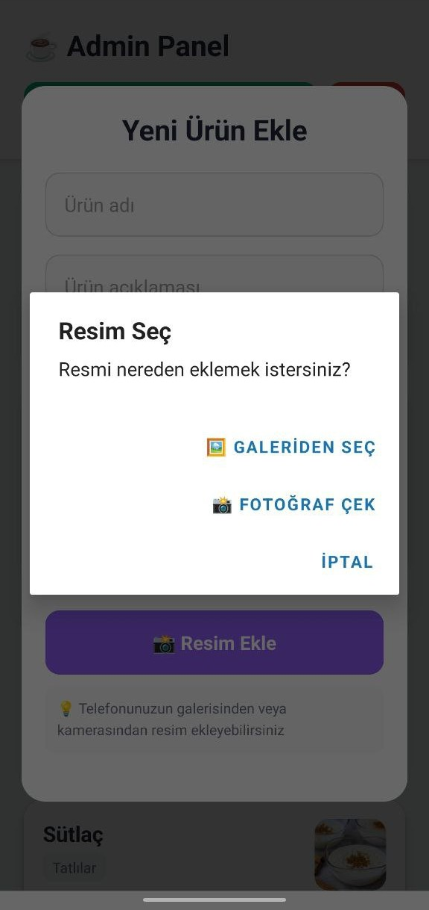
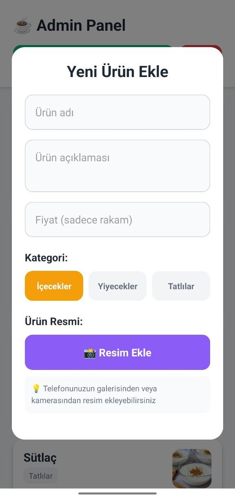
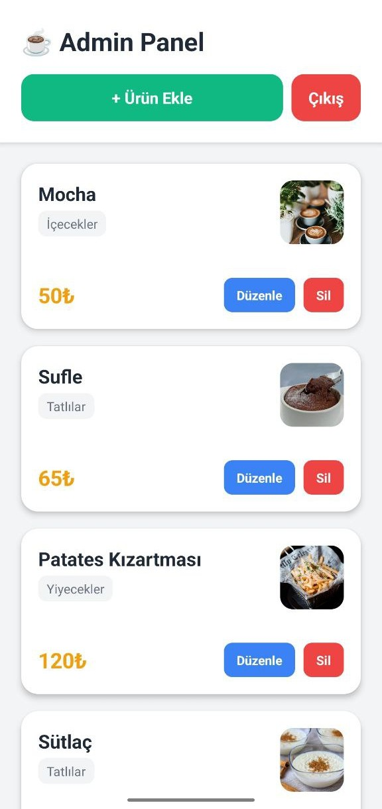
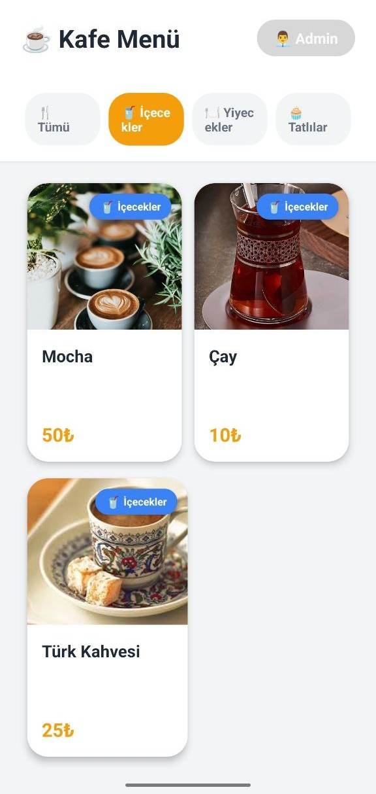
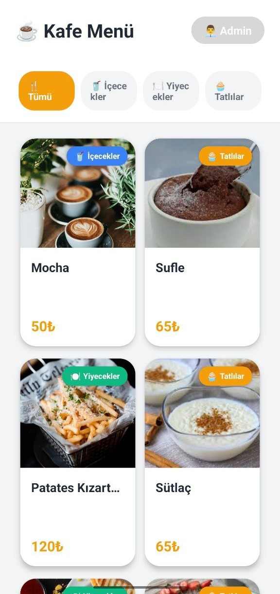

# ☕ QR Menü Sistemi - Dijital Kafe Menüsü

Modern kafeler ve restoranlar için geliştirilmiş, QR kod tabanlı dijital menü yönetim sistemi.

## 📱 Proje Hakkında

Bu proje, yeni açılan bir kafe için geliştirdiğim tam özellikli bir dijital menü sistemidir. Müşteriler masalarındaki QR kodu okutarak menüye anında erişebilir, işletme sahipleri ise admin panelinden kolayca menü yönetimi yapabilir.

### ✨ Öne Çıkan Özellikler

- 📱 **Cross-Platform**: iOS, Android ve Web desteği
- 🔐 **Güvenli Admin Paneli**: Firebase Authentication ile korumalı
- 📸 **Görsel Yönetimi**: Kamera veya galeriden direkt ürün fotoğrafı ekleme
- 🏷️ **QR Kod Sistemi**: Masa bazlı menü erişimi ve takibi
- ⚡ **Real-Time Updates**: Anlık menü güncellemeleri
- 📊 **İstatistikler**: Masa tarama verileri ve analitik
- 🎨 **Modern UI/UX**: Kullanıcı dostu arayüz tasarımı

## 🚀 Teknolojiler

### Frontend
- **React Native** - Cross-platform mobil uygulama geliştirme
- **Expo Router** - File-based routing sistemi
- **React Hooks** - State yönetimi

### Backend
- **Firebase Firestore** - NoSQL veritabanı
- **Firebase Authentication** - Kullanıcı kimlik doğrulama
- **Firebase Storage** - Dosya depolama

### Diğer Servisler
- **Cloudinary** - Profesyonel görsel yönetimi ve CDN
- **Expo Image Picker** - Kamera ve galeri entegrasyonu

## 📋 Gereksinimler

- Node.js (v14 veya üzeri)
- npm veya yarn
- Expo CLI
- Firebase hesabı
- Cloudinary hesabı

  
  

  
  

  

